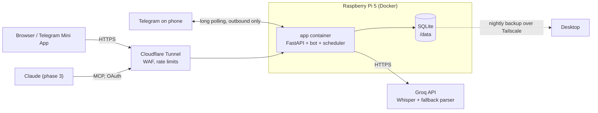

# Architecture

## Components

| Component | Where | Notes |
| --- | --- | --- |
| API | `backend/src/training_coach/api` | FastAPI; serves dashboard at `/`, API at `/api`, health at `/healthz` |
| Bot | `backend/src/training_coach/bot` | python-telegram-bot, long polling, owner-only (ADR-0009) |
| Scheduler | bot JobQueue | morning message, nudge, nightly backup; Europe/Berlin |
| Domain | `backend/src/training_coach/domain` | pure logic: queue, targets, progression, parsing |
| Services | `backend/src/training_coach/services` | use cases, Groq client |
| Storage | SQLite in `/data` | WAL, migrations via Alembic (ADR-0010) |
| Dashboard | `frontend/` | React + Vite + Tailwind, built into the image (ADR-0004) |

## Request paths

- **Log by voice**: Telegram -> bot handler -> Groq transcription -> rule parser (LLM fallback)
  -> confirmation message -> Save -> transaction (`workouts`, `set_logs`) -> queue advances ->
  feedback (bests, progression).
- **Morning**: JobQueue -> queue.next() -> targets -> message with buttons.
- **Dashboard**: Cloudflare -> cloudflared on host -> `127.0.0.1:8080` -> FastAPI -> SQLite.

## Environments

| Env | How | Data |
| --- | --- | --- |
| development | `make dev-api` + `make dev-web` on the desktop, optional test bot token | `backend/data/` |
| test | pytest, in-memory or tmp SQLite | ephemeral |
| production | `make up` on the Pi | `./data` volume |

Use a separate Telegram bot (second BotFather token) for development so testing never touches
the production chat.
