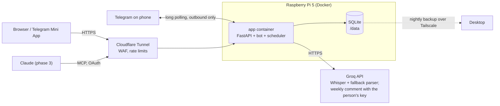

# Architecture

## Components

| Component | Where | Notes |
| --- | --- | --- |
| API | `backend/src/training_coach/api` | FastAPI; serves dashboard at `/`, API at `/api`, health at `/healthz` |
| Bot | `backend/src/training_coach/bot` | python-telegram-bot, long polling, owner-only (ADR-0009) |
| Scheduler | bot JobQueue; an app task for backups | morning message and nudge; the nightly backup runs from the app lifespan so it works with the bot off; Europe/Berlin |
| Domain | `backend/src/training_coach/domain` | pure logic: queue, targets, progression, parsing |
| Services | `backend/src/training_coach/services` | use cases, Groq client |
| Storage | SQLite in `/data` | WAL, migrations via Alembic (ADR-0010) |
| Dashboard | `frontend/` | React + Vite + Tailwind, built into the image (ADR-0004) |

## Request paths

- **Log by voice**: Telegram -> bot handler -> Groq transcription -> rule parser (LLM fallback)
  -> confirmation message -> Save -> transaction (`workouts`, `set_logs`) -> queue advances ->
  feedback (bests, progression).
- **Morning**: JobQueue -> queue.next() -> targets -> message with buttons.
- **Weekly review and AI comment** (ADR-0047): JobQueue (Sunday) -> review text -> sent; then,
  if the person stored a Groq key, `services/ai_comment` opens it (`secret_box`, under
  `TC_SECRETS_KEY`), sends the 4-week `ai_summary` to Groq with their key, cleans the answer
  and sends it labelled. Untrusted text: never stored or acted on.
- **Share** (ADR-0050): `/share` -> `services/share_card` reads the last 4 weeks and draws a PNG
  (Pillow) -> sent as a photo. No public route.
- **Undo** (ADR-0048): `/undo` -> `services/undo` finds the last rest, push, swap or log event,
  checks the queue hasn't moved since -> confirm -> restores the queue and removes the workout.
- **Sensitive web changes** (ADR-0040, ADR-0049): a 403 from a `Fresh` route -> the web app
  asks for the fingerprint (`/api/auth/passkeys/confirm`) -> the session is marked confirmed ->
  the change is retried.
- **Dashboard**: Cloudflare -> cloudflared on host -> `127.0.0.1:8080` -> FastAPI -> SQLite.

## Environments

| Env | How | Data |
| --- | --- | --- |
| development | `make dev-api` + `make dev-web` in WSL 2 on the Windows desktop (ADR-0018), optional test bot token | `backend/data/` |
| test | pytest, in-memory or tmp SQLite | ephemeral |
| production | `docker compose up -d --build` on the Pi | `./data` volume |

Use a separate Telegram bot (second BotFather token) for development so testing never touches
the production chat.
